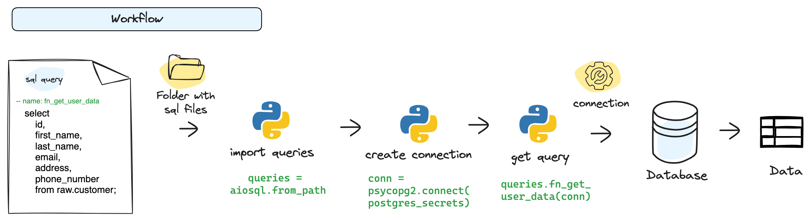
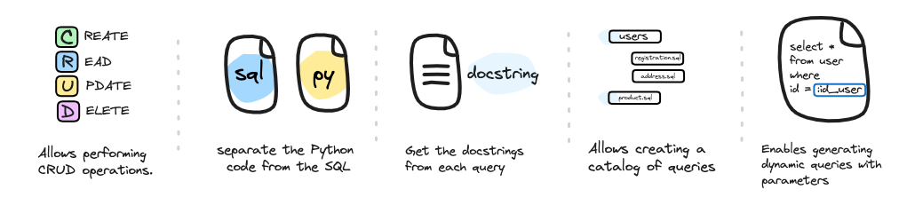

# ⚙️ What is aiosql library?

Aiosql is a Python library that simplifies the writing of SQL queries in separate files from your main Python project code. These queries, stored in SQL files, are then transformed into methods within a Python object. 
Another notable feature of Aiosql is its ability to generate dynamic methods that accept parameters, enabling flexible query execution and effective interaction with the underlying database. This separation of SQL queries from the main Python code promotes cleaner and more modular code, enhancing project readability and maintainability

# ⚙️ Key Features of Aiosql Library

Below, I will share a series of features that this library already has or can have based on its usage:
* Provides **CRUD functionality** (Create: Insert, Read: Select, Update , Delete) for database operations.
* **Separates Python code** from SQL code, making it easier to locate queries within projects with multiple databases.
* Each query can be assigned a **descriptive name and docstring**, similar to Python functions, enabling documentation of the query.
* Facilitates the creation of **a query catalog** within the project, aiding in identification based on entities, databases, or other grouping criteria.
* Enables easy generation of **dynamic queries** with the ability to pass dynamic values and modify them as needed.

---

## 🚀 Quick Start

### 🛠️ Tutorial
Explore this tutorial, which covers database creation, defining queries from user stories, and additional functionality such as creating a query catalog.

### 🛠️ Exploring aiosql: Hands-on Exercise
Access the aiosql code in the 'main.ipynb' notebook, where you'll delve into a simple exercise involving three user stories. This exercise will simulate a project's interaction with a **PostgreSQL database**, with detailed instructions on how to set it up provided in the following section.

### 🛠️ Create a PostgreSQL database

* 1️⃣ - **Clone this [repository: aiosql-tutorial](https://github.com/r0mymendez/aiosql-tutorial/tree/master)** → `https://github.com/r0mymendez/aiosql-tutorial.git`
* 2️⃣ - **Change directory** to the 'postgres' folder → `cd postgres`
* 3️⃣ - **Create postgres database** → Execute in the terminal: `docker-compose -f docker-compose.yml up --build`
* 4️⃣ - **Check if your container is running** → Execute in the terminal: `docker ps`
* 5️⃣ - **Load the csv files** → Execute the following command for load the csv file in the container: `python3 etl.py`
  
### 🏥 Hospital Data
To implement aiosql, we will use the datasets from [Synthea](https://synthea.mitre.org/), which simulates a hospital database. These synthetic data are generated from a simulation considering various variables of a population in Massachusetts. 
From these datasets, we will use the tables: `conditions`, `encounters`, and `patients`. 

---

